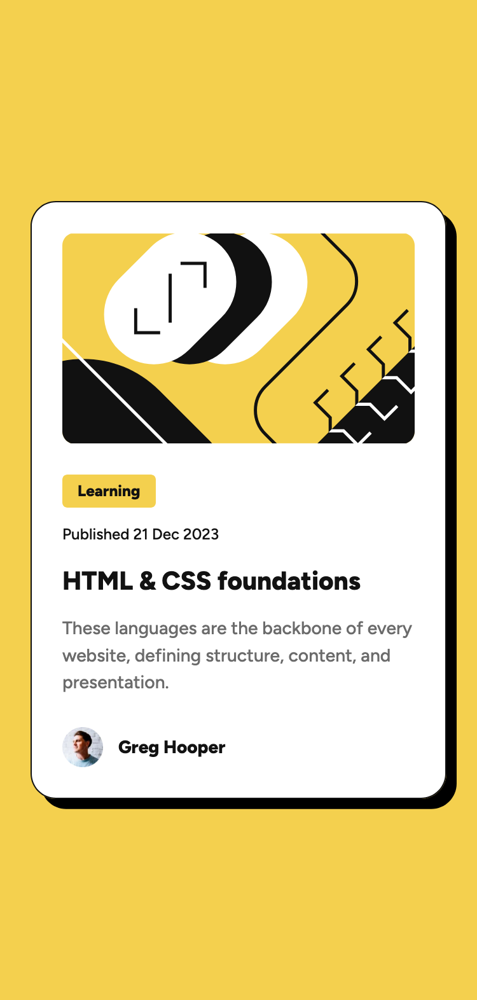
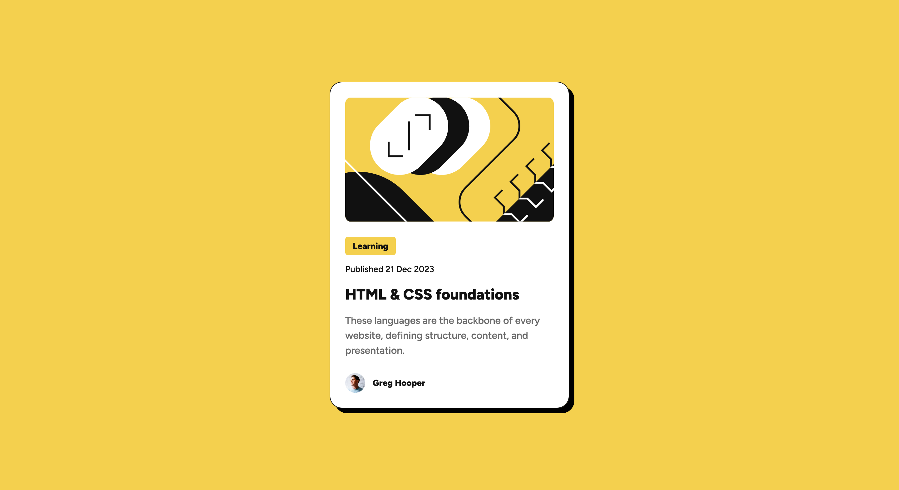
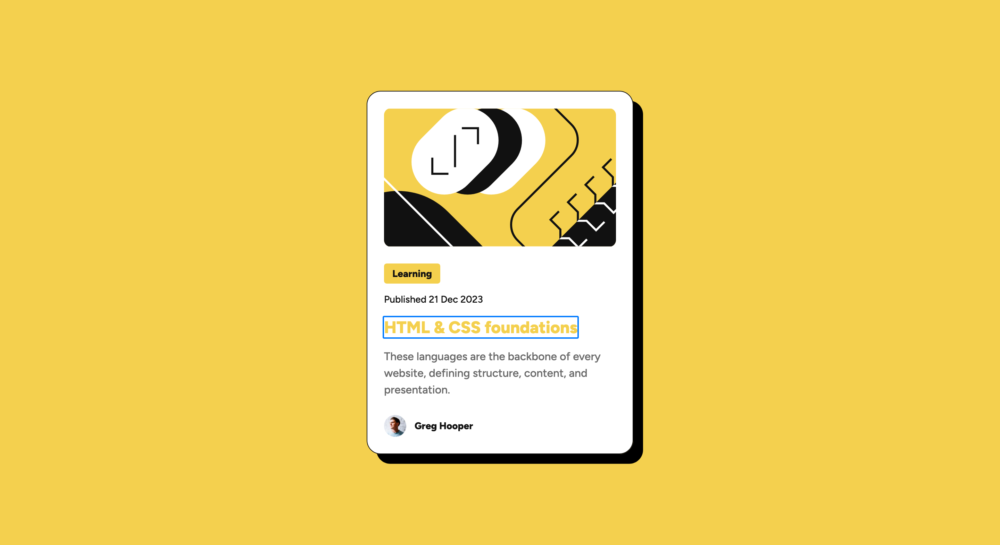

# Frontend Mentor - Blog preview card solution

This is my solution to the [Blog preview card challenge on Frontend Mentor](https://www.frontendmentor.io/challenges/blog-preview-card-ckPaj01IcS), a platform that helps improve your coding skills by building realistic projects.

## Table of contents

- [Overview](#overview)
  - [The challenge](#the-challenge)
  - [Screenshots](#screenshots)
  - [Links](#links)
- [My process](#my-process)
  - [Built with](#built-with)
  - [What I learnt](#what-i-learnt)
  - [Useful resources](#useful-resources)

## Overview

### The challenge

Users should be able to:

- See hover and focus states for all interactive elements on the page

### Screenshots

Mobile:



Desktop:



Hover:


Focus:



### Links

- [Solution URL](https://www.frontendmentor.io/solutions/blog-preview-card-component-using-flexbox-RU2NPFXbJ-)
- [Live site URL](https://blog-preview-card-beryl-one.vercel.app/)

## My process

### Built with

- Semantic HTML5 markup
- CSS custom properties
- Flexbox
- Mobile-first workflow

### What I learnt

I learnt a lot from this project, especially about creating responsive typography without using media queries.

In the mobile layout, the font sizes for the category, date, title and description are slightly smaller.

To fluidly scale the typography from smaller to larger screens without using media queries, I used the `clamp()` function with values generated from [Utopia](https://utopia.fyi/clamp/calculator?a=320,1440,16%E2%80%9448).

```css
:root {
  --fs-xs: 0.75rem;
  --fs-sm: 0.875rem;
  --fs-md: 1rem;
  --fs-lg: 1.25rem;
  --fs-xl: 1.5rem;

  /* Fluid type scale with clamp() */
  --text-fluid-sm: clamp(var(--fs-xs), 0.7143rem + 0.1786vw, var(--fs-sm));
  --text-fluid-md: clamp(var(--fs-sm), 0.8393rem + 0.1786vw, var(--fs-md));
  --text-fluid-lg: clamp(var(--fs-lg), 1.1786rem + 0.3571vw, var(--fs-xl));
}
```

I also learnt about the differences between the `:focus`, `:focus-visible` and `:focus-within` pseudo-classes.

The `:focus` pseudo-class matches an element that receives focus.

The `:focus-visible` pseudo-class also targets focused elements, but it only applies when the browser determines a visual indicator is necessary – typically when navigating via keyboard.

The `:focus-within` pseudo-class matches an element that contains a focusable element.

I also found that CSS nesting is particularly helpful when styling `:hover` and focus states:

```css
.card {
  /* Nested hover and focus styling using native CSS nesting */
  &:hover,
  &:focus-within {
    box-shadow: var(--shadow-hover);
  }
}
```

Lastly, I learnt how to make the entire card clickable. The snippet below makes the link cover the entire card, making it fully clickable:

```css
.card {
  position: relative;
}

.card__link::after {
  content: "";
  position: absolute;
  inset: 0;
}
```

### Useful resources

- [Quick guide to CSS focus states](https://www.youtube.com/watch?v=apdD69J4bEc&list=PL7D2gu7LPEhPummrObfBJc3mRlQabwWW0&index=5) - This video by Kevin Powell helped me understand the differences between `:focus`, `:focus-visible` and `:focus-within`.
- [Inclusive Components - Cards](https://inclusive-components.design/cards/) - This chapter from Heydon Pickering's Inclusive Components book helped me make the whole card clickable. Instead of the `top`, `right`, `bottom` and `left` properties mentioned in the book, I used the `inset` property.
