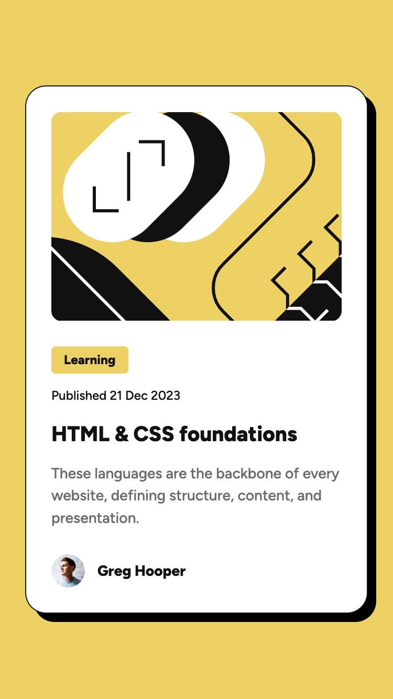
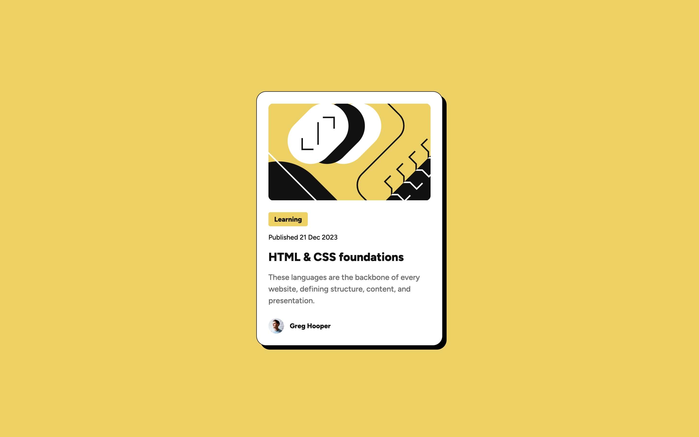

# Blog Preview Card

A responsive blog preview card built with semantic HTML and modern CSS. It focuses on accessible markup, a fully clickable card with a single link, design tokens, and fluid typography.

## 🔗 Links

Live site: [View live](https://blog-preview-card-dionysialemonaki.vercel.app/)

## ✅ Acceptance Criteria

Users should be able to:

- See hover and focus states for all interactive elements on the page

## 📸 Screenshots

Mobile:



Desktop:



## 🏗️ Built With

- Semantic HTML
- CSS (custom properties, nesting, `clamp()`, Flexbox)
- Variable web font (WOFF2)

## 🎨 What I Focused On

### Semantic, Accessible Markup

The card is an `<article>` labelled by its own heading via `aria-labelledby`, inside `<main>`. The publish date uses `<time datetime="2023-12-21">` so the date is machine-readable. Decorative images use `alt=""` so screen readers skip them, and every image has explicit `width` and `height` to reserve space and prevent layout shift.

```html
<main>
  <article class="card" aria-labelledby="html-css-foundations">
    
    <div class="card-content">
      <p class="card-category">Learning</p>
      <p class="card-date">
        Published <time datetime="2023-12-21">21 Dec 2023</time>
      </p>
      <h2 class="card-title" id="html-css-foundations">
        <a href="#" class="card-link">HTML & CSS foundations</a>
      </h2>
      <p class="card-description">
        These languages are the backbone of every website, defining structure,
        content, and presentation.
      </p>
    </div>
    <div class="card-footer">
      
      <p class="card-author">Greg Hooper</p>
    </div>
  </article>
</main>
```

### Fully Clickable Card With One Link

Screen readers announce a single, clear link name instead of the entire card's content, which is what happens when the whole card is wrapped in an `<a>`.

A `::after` pseudo-element on that link stretches across the positioned `.card`, so the whole card is clickable with the mouse. Hovering anywhere on the card triggers the link's hover state, and `:focus-visible` gives keyboard users a clear outline.

```css
.card {
  display: flex;
  flex-direction: column;
  gap: 24px;
  background-color: var(--color-white);
  max-width: 24rem;
  padding: 24px;
  border: 1px solid var(--color-gray-950);
  border-radius: 20px;
  box-shadow: 8px 8px 0 hsl(0 0% 0%);
  position: relative;

  &:hover {
    box-shadow: 16px 16px 0 hsl(0 0% 0%);
  }
}

.card-link {
  font-weight: var(--font-weight-extrabold);
  font-size: var(--text-fluid-lg);
  color: inherit;
  text-decoration: none;

  &:hover {
    color: var(--color-yellow);
  }

  &:focus-visible {
    outline: 2px solid var(--color-gray-950);
    outline-offset: 2px;
  }

  &::after {
    content: "";
    position: absolute;
    inset: 0;
  }
}
```

### Design Tokens With Custom Properties

Colors, font family, weights, and the type scale are defined once on `:root` and reused everywhere, so the design system lives in one place and stays consistent.

```css
:root {
  --color-yellow: hsl(47 88% 63%);
  --color-gray-950: hsl(0 0% 7%);
  --color-gray-500: hsl(0 0% 42%);
  --color-white: hsl(0 0% 100%);

  --font-figtree: "Figtree", sans-serif;
  --font-weight-medium: 500;
  --font-weight-extrabold: 800;

  --text-xs: 0.75rem;
  --text-sm: 0.875rem;
  --text-base: 1rem;
  --text-xl: 1.25rem;
  --text-2xl: 1.5rem;
  --text-fluid-xs: clamp(var(--text-xs), 0.7143rem + 0.1786vw, var(--text-sm));
  --text-fluid-sm: clamp(
    var(--text-sm),
    0.8393rem + 0.1786vw,
    var(--text-base)
  );
  --text-fluid-lg: clamp(var(--text-xl), 1.1786rem + 0.3571vw, var(--text-2xl));
}
```

### Fluid Typography Without Media Queries

Font sizes scale smoothly between a minimum and maximum using `clamp()`, built on the same rem-based scale tokens. The text adapts to any viewport without breakpoints.

```css
:root {
  --text-fluid-lg: clamp(var(--text-xl), 1.1786rem + 0.3571vw, var(--text-2xl));
}
```

### Performance and Clean CSS

The variable font is self-hosted as WOFF2 with `font-display: swap`, so text renders immediately while the font loads. A small reset (`box-sizing: border-box`, zeroed margins) keeps the base predictable, and native CSS nesting keeps hover, focus, and pseudo-element styles next to the rule they belong to.

## Credits

Design from [Frontend Mentor](https://www.frontendmentor.io/challenges/blog-preview-card-ckPaj01IcS)
